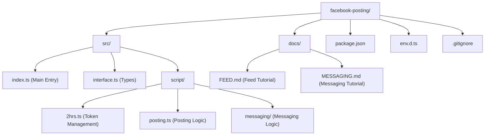

# Facebook Posting Tool
### MPOP Reverse II [Ryann Kim Sesgundo]

A TypeScript-based tool for automating multi-photo and media postings to Facebook Pages.

## Version
`1.1.0`

## File Structure



## Tutorials

Detailed guides for each feature:
- [Facebook Feed Posting Tutorial](./docs/FEED.md)
- [Facebook Messenger Tutorial](./docs/MESSAGING.md)

## Dependencies

### Core
- **axios**: `^1.17.0` - For handling HTTP requests to the Facebook Graph API.
- **dotenv**: `^17.4.2` - For managing environment variables.

### Development
- **typescript**: `^6.0.3`
- **tsx**: Used for running the project directly in TypeScript.
- **ts-node**: `^10.9.2`
- **@types/node**: `^25.9.3`

## Configuration

1. Copy the sample environment file:
   ```bash
   cp .env.sample .env
   ```
2. Fill in the required variables in your `.env` file:
   - `APP_ID`: Your Facebook App ID.
   - `APP_SECRET`: Your Facebook App Secret.
   - `SHORT_TERM_TOKEN`: A short-lived user access token (see below).
   - `PAGE_ID`: The ID of the Facebook Page you want to post to.

## How to Obtain Facebook Tokens

### 1. Short-Lived User Access Token (2 Hours)
1. Go to the [Facebook Graph API Explorer](https://developers.facebook.com/tools/explorer/).
2. Select your App and the User you want to post as.
3. Add the following permissions:
   - `pages_manage_posts`
   - `pages_read_engagement`
   - `pages_show_list`
4. Click **Generate Token**. This token usually lasts for 2 hours. Copy this to `SHORT_TERM_TOKEN` in your `.env`.

### 2. Long-Lived User Access Token (2 Months)
To generate a 60-day token, ensure `APP_ID`, `APP_SECRET`, and `SHORT_TERM_TOKEN` are set in your `.env` file. Then run:

```bash
npm run token
```
This script will exchange your short-lived token for a long-lived one and automatically update the `FB_TOKEN` in your `.env` file.

### 3. Page Access Token
This project includes a `TwoHourToken` script (`src/script/2hrs.ts`) that automatically handles fetching the correct Page Access Token from the `/me/accounts` endpoint using your provided credentials.

## Credits

- **AI Assistance**: [ChatGPT](https://chatgpt.com) & [Gemini](https://gemini.google.com)
- **Developer**: Ryann Kim Sesgundo
