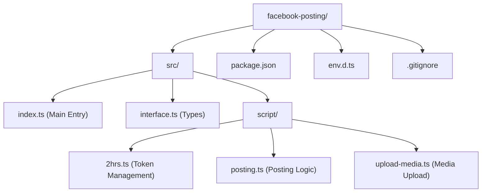

# Facebook Posting Tool
### MPOP Reverse II [Ryann Kim Sesgundo]

A TypeScript-based tool for automating multi-photo and media postings to Facebook Pages.

## Version
`1.0.0`

## File Structure



## Dependencies

### Core
- **axios**: `^1.17.0` - For handling HTTP requests to the Facebook Graph API.
- **dotenv**: `^17.4.2` - For managing environment variables.

### Development
- **typescript**: `^6.0.3`
- **tsx**: Used for running the project directly in TypeScript.
- **ts-node**: `^10.9.2`
- **@types/node**: `^25.9.3`

## Configuration

Create a `.env` file in the root directory with the following variables:

```env
FB_TOKEN=your_short_lived_or_long_lived_token
PAGE_ID=your_facebook_page_id
```

## How to Obtain Facebook Tokens

### 1. Short-Lived User Access Token (2 Hours)
1. Go to the [Facebook Graph API Explorer](https://developers.facebook.com/tools/explorer/).
2. Select your App and the User you want to post as.
3. Add the following permissions:
   - `pages_manage_posts`
   - `pages_read_engagement`
   - `pages_show_list`
4. Click **Generate Token**. This token usually lasts for 2 hours.

### 2. Long-Lived User Access Token (2 Months)
To convert your 2-hour token into a 60-day token:
1. Use the Access Token Tool or exchange it via the API:
   ```text
   GET /oauth/access_token?  
       grant_type=fb_exchange_token&           
       client_id={app-id}&
       client_secret={app-secret}&
       fb_exchange_token={short-lived-token}
   ```
2. Alternatively, the project's internal logic uses the provided token to fetch Page Access Tokens.

### 3. Page Access Token
The project includes a `TwoHourToken` script (`src/script/2hrs.ts`) that automatically handles fetching the correct Page Access Token from the `/me/accounts` endpoint using your provided credentials.

## Usage

To start the posting process, run:

```bash
npm start
```

This will execute `src/index.ts`, which initializes the token and prepares the posting logic.

## Credits

- **AI Assistance**: [ChatGPT](https://chatgpt.com) & [Gemini](https://gemini.google.com)
- **Developer**: Ryann Kim Sesgundo
